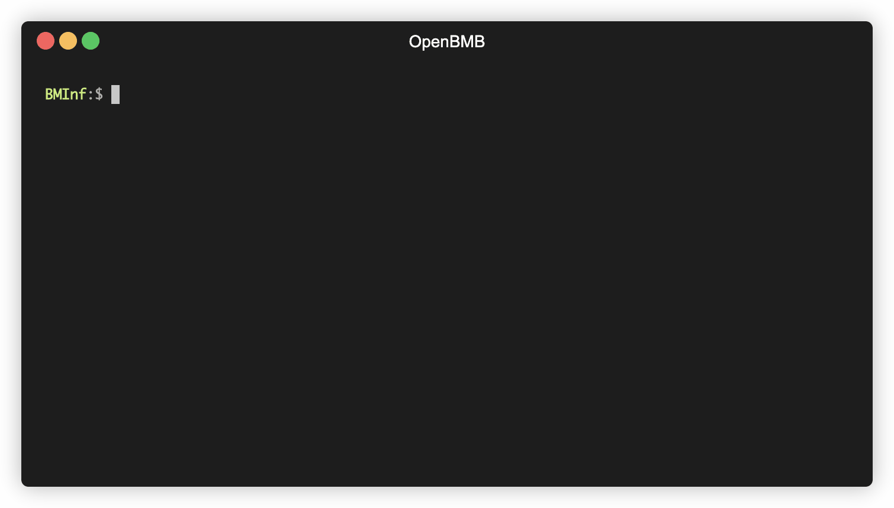

# 安装

## 用pip安装 (推荐)
```
pip install bminf
```

## 从源代码安装
```
git clone https://github.com/OpenBMB/BMInf.git
cd BMInf
python setup.py install
```

## 从Docker安装 
```
docker run -it --gpus 1 -v $HOME/.cache/bigmodels:/root/.cache/bigmodels --rm openbmb/bminf python3 examples/fill_blank.py
```

安装完成后, 你可以运行``examples``文件夹中的样例来检查是否安装正确。

```
python examples/fill_blank.py
```



## 硬件要求

在下表中我们列出了运行BMInf的最低配置与推荐配置：

| | 最低配置 | 推荐配置 |
|-|-|-|
| 内存 | 16GB | 24GB
| GPU | NVIDIA GeForce GTX 1060 6GB | NVIDIA Tesla V100 16GB
| PCI-E |  PCI-E 3.0 x16 |  PCI-E 3.0 x16

BMInf支持基于NVIDIA Pascal架构及更新架构的GPU，查看[对照表](https://en.wikipedia.org/wiki/CUDA#GPUs_supported)来明确你的GPU是否被支持。

## 软件要求

BMInf需要安装CUDA 10.1及以上版本，所有的依赖包都会在安装过程中自动被安装。

- **python** >= 3.6
- **requests**
- **tqdm** 
- **jieba**
- **numpy** 
- **cupy-cuda<你的cuda版本>** >= 9, <10

下表列出了cupy安装包和CUDA版本的对应关系。别担心，cupy的安装过程也是自动完成的。

| CUDA版本 | 包名称 |
|-|-|
v10.1 | cupy-cuda101
v10.2 | cupy-cuda102
v11.0 | cupy-cuda110
v11.1 | cupy-cuda111
v11.2 | cupy-cuda112
v11.3 | cupy-cuda113
v11.4 | cupy-cuda114

